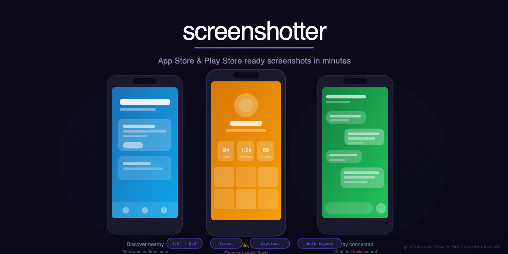

# screenshotter



**Upload your app screens, get App Store and Play Store ready marketing screenshots in minutes. No Figma. No designer needed.**

---

## Origin Story

Every mobile developer has spent hours in Figma making screenshot frames. Dragging device mockups around. Adjusting gradients pixel by pixel. Writing and rewriting that perfect three-word headline.

**screenshotter** automates the boring part so you can ship faster.

Drop in your raw app screenshots. Pick a style. Let AI write the captions. Download a ZIP ready for App Store Connect or Google Play Console.

What used to take an afternoon now takes five minutes.

---

## How It Works

### 1. Upload Screenshots
Drag and drop up to 10 PNG or JPG screenshots. These are your raw app screens — no preprocessing needed.

### 2. Choose Your Style
Pick a device frame (iPhone 15 Pro, Pixel 8, or frameless) and a background style (gradients, solid colors, or a blurred version of the screenshot itself).

### 3. Generate Captions
Claude Vision analyzes each screenshot and generates three punchy headline options. Pick one, or write your own. Captions appear at the top or bottom of your final screenshots.

### 4. Download
Export everything as a ZIP file with App Store–ready dimensions (1290×2796 for iPhone, 1080×2400 for Android).

---

## AI Caption Generation

**screenshotter** uses Claude's vision capabilities to understand what's happening in your screenshot and write compelling App Store marketing copy.

```
Input: Screenshot of a food delivery checkout screen
Output: 
  • "Order in seconds"
  • "Your meals, delivered"
  • "Fresh to your door"
```

The AI considers:
- Visual elements on screen (buttons, images, text)
- Your app's name and category
- Your one-line description
- App Store headline best practices (action-oriented, under 30 characters)

No API key? No problem. Manual caption input is always available.

---

## Output Formats

| Platform | Dimensions | Format |
|----------|------------|--------|
| iPhone | 1290 × 2796px | PNG |
| Android | 1080 × 2400px | PNG |

All screenshots are exported at full resolution with the device frame, background, and caption composited into a single image.

The ZIP file structure:
```
screenshotter-export-2024-01-15/
├── screenshot-01-1290x2796.png
├── screenshot-02-1290x2796.png
├── screenshot-03-1290x2796.png
└── ...
```

---

## Tech Stack

- **React 18** + **Vite** — Fast development and builds
- **Tailwind CSS** — Utility-first styling
- **Framer Motion** — Smooth animations
- **Canvas API** — Screenshot composition and rendering
- **Claude API** — AI-powered caption generation
- **JSZip** — Client-side ZIP creation

No backend. Everything runs in your browser. Your API key is stored in localStorage and never leaves your device.

---

## Getting Started

### Prerequisites
- Node.js 18+
- An Anthropic API key (optional, for AI captions)

### Installation

```bash
# Clone the repository
git clone https://github.com/Aswin-Dot/screenshotter.git
cd screenshotter

# Install dependencies
npm install

# Start the development server
npm run dev
```

Open [http://localhost:5173](http://localhost:5173) in your browser.

### Production Build

```bash
npm run build
npm run preview
```

---

## Configuration

### API Key Setup

1. Get your API key from [console.anthropic.com](https://console.anthropic.com)
2. Click the gear icon in screenshotter
3. Paste your API key
4. Keys are stored locally and never sent to any server except Anthropic's API

### App Context

For better AI-generated captions, fill in:
- **App Name** — Your app's display name
- **Category** — Food & Drink, Shopping, Productivity, etc.
- **Description** — One line about what your app does

---

## Design System

screenshotter uses a clean, light theme optimized for reviewing visual content:

| Token | Value | Usage |
|-------|-------|-------|
| Background | `#f8f8fc` | Page background |
| Surface | `#ffffff` | Cards and panels |
| Accent | `#5b4fe8` | Primary actions |
| Text | `#1a1a2e` | Body text |
| Muted | `#7070a0` | Secondary text |

Typography: [Plus Jakarta Sans](https://fonts.google.com/specimen/Plus+Jakarta+Sans) for headings and body, [DM Mono](https://fonts.google.com/specimen/DM+Mono) for code and labels.

---

## Device Frames

| Frame | Style |
|-------|-------|
| iPhone 15 Pro (Black Titanium) | Modern rounded corners, Dynamic Island |
| iPhone 15 Pro (White Titanium) | Same frame, lighter color |
| Pixel 8 (Obsidian) | Android-style corners, punch-hole camera |
| No Frame | Just the screenshot with rounded corners |

Frames are rendered geometrically — clean, modern, and fast to render.

---

## Background Styles

| Style | Description |
|-------|-------------|
| Ocean | Deep blue → teal gradient |
| Sunset | Orange → pink gradient |
| Forest | Dark green → lime gradient |
| Midnight | Navy → purple gradient |
| White | Solid white |
| Black | Solid black |
| Blur | Blurred, saturated version of the screenshot |

---

## Live Demo

**[aswin-dot.github.io/screenshotter](https://aswin-dot.github.io/screenshotter)**

---

## Contributing

Contributions are welcome! Please open an issue first to discuss what you'd like to change.

---

## License

MIT

---

*Built by [Aswin Raj](https://github.com/Aswin-Dot)*
